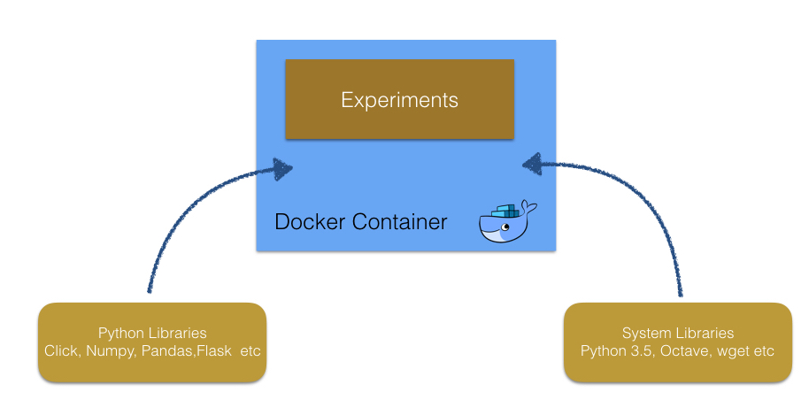

# Overview

[](https://travis-ci.org/docker-science/cookiecutter-docker-science)

Some researchers and software engineers do many machine learning or data mining tasks.
For such data engineering tasks, researchers apply various tools and system libraries, 
which are constantly updated. Unfortunately installing and updating them cause problems in local environments.
Even when we work in hosting environments such as EC2, we are not free from this problem. Some experiments
succeeded in one instance but failed in another one, since library versions of each EC2 instances could be different.

By contrast, we can creates the identical Docker container in which needed tools with the correct versions are
already installed in one command without changing system libraries in host machines. This aspect of Docker is
important for reproducibility of experiments, and keep the projects in continuous integration systems.




However working in a Docker containers is troublesome. Adding a new library into requirements.txt
or Dockerfile does not installed as if local machine. We need to create Docker image and container each time. We also need
to forward ports to see server responses such as Jupyter Notebook UI launch in Docker container in our local PC.
Cookiecutter Docker Science provides utilities to make working in Docker container simple.

This project is a tiny template for machine learning projects developed in Docker environments.
In machine learning tasks, projects glow uniquely to fit target tasks, but in the initial state, most directory
structure and targets in Makefile are common. Cookiecutter Docker Science generates initial directories which fits
simple machine learning tasks.

# Cycle of Machine Learning projects

Machine learning projects consist of three steps (Experiments, Code simplification, and Deployment).
The following is the image of the cycle.


In the begging we do experiments in Jupyter Notebook interactively. Then we simplify the code written in the notebooks.
In this step, add test, refactor code, apply linter, make library and CI. After we finished the code simplification, we deploy the model
to production use. In this phase, we add batch scripts or service using the library created at the previous step. After deployment,
we continue the improvement of model in Jupyter Notebook again.

# Work in Docker container

Ideally, we should work in a Docker container in every step of the machine learning projects generated by the same Dockerfile,
since we can begin code simplification and deployment seamlessly. The following is the image.


Cookiecutter Docker Science support the machine learning project from the experiments to deployment with Docker container.


# Usage: Cookiecutter Docker Science

This section described the usage of Cookiecutter Docker Science.


## Requirements

Cookiecutter Docker Science need the followings.

- Python 2.7 or Python 3.5
- Cookiecutter 1.6 or later
- Docker version 17 or later

## Getting Started

To generate project from the cookiecutter-doccker-science template, please run the following command.

```
$cookiecutter git@github.com:docker-science/cookiecutter-docker-science.git
```

Then the cookiecutter command ask for several questions on generated project as follows.

```
$cookiecutter git@github.com:docker-science/cookiecutter-docker-science.git
project_name [project_name]: food-image-classification
project_slug [food_image_classification]:
jupyter_host_port [8888]:
description [Please Input a short description]: Classify food images into several categories
data_source [Please Input data source in S3]: s3://research-data/food-images
```

## Directory structure

When we generate a project with Cookiecutter Docker Science, the project has the following files and directories.

```
├── Makefile                          <- Makefile contains many targets such as create docker container or
│                                        get input files.
├── config                            <- This directory contains configuration files used in scripts
│   │                                    or Jupyter Notebook.
│   └── jupyter_config.py
├── data                              <- data directory contains the input resources.
├── docker                            <- docker directory contains Dockerfile.
│   └── Dockerfile                    <- Dockerfile have the container settings. Users modify Dockerfile
│                                        if additional library is needed for experiments.
├── model                             <- model directory store the model files created in the experiments.
├── my_data_science_project           <- cookie-cutter-docker-science creates the directory whose name is same
│   │                                    as project name. In this directory users puts python files used in scripts
│   │                                    or Jupyter Notebook.
│   └── __init__.py
├── notebook                          <- This directory sotres the ipynb files saved in Jupyter Notebook.
├── requirements.txt                  <- Libraries needed to run experiments. The library listed in this file
│                                        are installed in the Docker container.
└── scripts                           <- Users add the script files to generate model files or run evaluation. 
```

## Work in each step (experiment, code simplification, and deployment)

